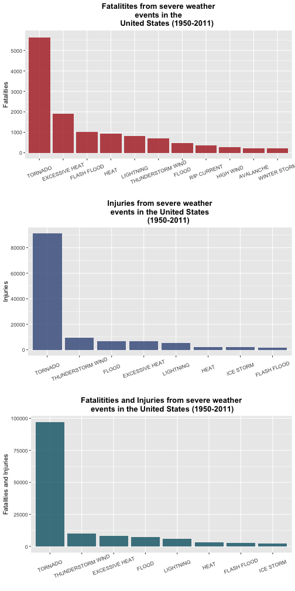
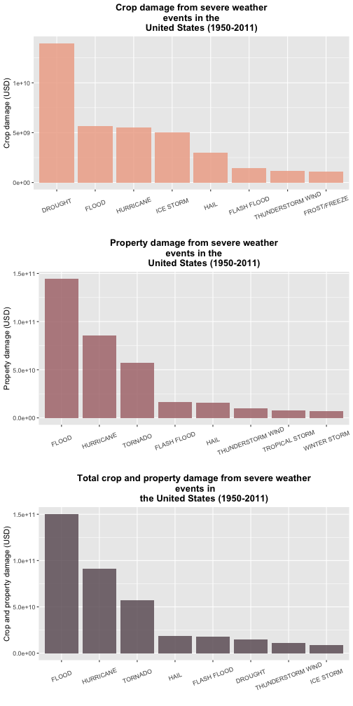

# Public Health and Economic Impact of Severe Weather Events Across the United States from 1950 to 2011
  
**Reproducible Research Course Project 2**  
**Author:** Maria Daniela Gracia    
**Date:** March 17, 2021  
 
### Synopsis 
  
The following analysis uses data from the NOAA Storm Database, this database tracks characteristics of major storms and weather events in the United States. This analysis addresses the following questions: 1) *Across the United States, which types of events are most harmful with respect to population health?* and 2) *Across the United States, which types of events have the greatest economic consequences?*. 

The structure for this particular analysis consists of a a) **data processing** section, where the data is loaded, cleaned and structured for the analysis. A b) **results** section where the data is studied to answer the questions above. With this analysis we were able to conclude that the events most harmful for population health (when looking at fatalities and injuries combined) are: 1) Tornado, 2) Thunderstorm wind, 3) Excessive heat, 4) Flood, 5) Lightning, 6) Heat, 7) Flash flood and 8) Ice storm. the events with greatest economic consequences are: 1) Flood, 2) Hurricane, 3) Tornado, 4) Hail, 5) Flash flood, 6) Drought, 7) Thunderstorm wind and 8) Ice storm.  
     
### Data Processing   
   
In this section we will load the raw data, understand it's different variables and based on that make it suitable for our analysis.  
  
#### **1. Loading the Data: **
The first step will be to load the data into R, load all the necessary packages for the analysis and explore the variables.  

In the first chunk we load all the packages that will be necessary for the analysis.

```r
# Here we load the packages needed for the analysis.
library(dplyr)
library(knitr)
library(ggplot2)
library(stringr)
library(gridExtra)
library(ggpubr)
```
    
Then we download the data and load it to R   

```r
# first we download the data
fileurl <- "https://d396qusza40orc.cloudfront.net/repdata%2Fdata%2FStormData.csv.bz2"
if(!file.exists("StormData.bz2")){
        download.file(fileurl, destfile = "StormData.bz2")
}

# second we load it to R, we don't have to decompress the file, and can do this directly using the read.csv() function
rawdata <- read.csv("StormData.bz2", header = TRUE, sep = ",")
```
    
We now want to get a better sense of what the data looks like, in order to understand it and make a plan to prepare it for the analysis.

```r
# we view it's structure
str(rawdata)
```
     
Now we know there are a few steps we need to take to prepare the data:  
  
1. Reduce the dataset by removing unnecessary variables.   
2. Re-class the remaining variables.    
3. Clean the EVTYPE variable.   
4. Calculate total values of crop and property damage ('CROPDMGEXP' are the exponent values for 'CROPDMG' and in the same way, 'PROPDMGEXP' are the exponent values for 'PROPDMG').     
    
#### **2. Reduce dataset: **  
The first step is to remove variables that are not necessary for the analysis, meaning those unrelated to the questions we are studying.     

```r
# first we are going to clone our raw data into a new data frame that we will clean and work with
mydata <- rawdata

# second we will reduce the dataset so that only pertinent variables are present
keep <- c("STATE__","BGN_DATE","STATE","EVTYPE","FATALITIES","INJURIES","PROPDMG","PROPDMGEXP","CROPDMG","CROPDMGEXP","REFNUM")
mydata <- mydata %>% select(all_of(keep)) %>% 
          rename(STATE_CODE = STATE__, DATE = BGN_DATE)
```
  
#### **3. Re-class variables: **     
Now we will change the classes of some of the variables to make them more interesting. We will turn some variables into factors and time variables into time class.   

```r
# first we transform dates
mydata$DATE <- as.Date(mydata$DATE, format="%m/%d/%Y")

# second we transform factors
factors <- c("STATE","STATE_CODE")
mydata[,factors] <- lapply(mydata[,factors], as.factor)
```
 
#### **4. Clean EVTYPE:  **   
As our analysis highly depends on the EVTYPE variable we will focus on making sure this column is clean and good for analysis.  

```r
# here we take a look at all the unique values of EVTYPE and their frequency
l <- length(unique(mydata$EVTYPE))
```
     
We see it has **<span style="color:red">985</span>** levels, which is far from the 48 official event types. We also see some of the values have been typed in upper case and others in lowercase, some values have added numbers and words, etc. In order to make this variable more useful we will: 

1. Find the percentage of events that have been cataloged according the official list.  
2. Use regular expressions to re-catalog rows in which there are typos.  
3. Check the percentage of events that have been cataloged according the official list after fixing this.    
4. Repeat until we reach > 98% of events properly cataloged.    
5. Subset the list and discard all events improperly cataloged.   

```r
# we make sure all the values in the EVTYPE variable are in uppercase
mydata$EVTYPE <- toupper(mydata$EVTYPE)

# define a vector with the official list of events
official <- c("Astronomical Low Tide ","Avalanche","Blizzard","Coastal Flood","Cold/Wind Chill","Debris Flow","Dense Fog","Dense Smoke","Drought","Dust Devil","Dust Storm","Excessive Heat","Extreme Cold/Wind Chill","Flash Flood","Flood","Frost/Freeze","Funnel Cloud","Freezing Fog","Hail","Heat","Heavy Rain","Heavy Snow","High Surf","High Wind","Hurricane","Ice Storm","Lake-Effect Snow","Lakeshore Flood","Lightning","Marine Hail","Marine High Wind","Marine Strong Wind","Marine Thunderstorm Wind","Rip Current","Seiche","Sleet","Storm Surge/Tide","Strong Wind","Thunderstorm Wind","Tornado","Tropical Depression","Tropical Storm","Tsunami","Volcanic Ash","Waterspout","Wildfire","Winter Storm","Winter Weather")
official <- official %>% toupper() %>% as.factor()

# define a function to calculate the percentage of events in the official list
per <- function(x) {
        m<-table(official[match(x$EVTYPE,official)])
        ans <- (sum(m)*100)/902297
        print (ans)
}
# we save the initial percentage of events in the official list in per1
per1 <- per(mydata)
```

```
## [1] 70.41484
```
We can see **<span style="color:red">70.4148412 % </span>** of the events are properly cataloged, if we decided to let go of all events improperly cataloged we would loose almost 30% of the data. For this reason now we will use regex to reach somewhere near the > 98% mark and then we will subset the data with the official list.   

```r
# remove all white space from start and end 
mydata$EVTYPE <- str_trim(mydata$EVTYPE)

# use gsub() in order to clean the values, mostly we will attempt to remove typing errors and noticeable mistakes without making too many assumptions.
mydata$EVTYPE <- gsub("[0-9]","",mydata$EVTYPE)
mydata$EVTYPE <- gsub("MPH","",mydata$EVTYPE)
mydata$EVTYPE <- gsub("\\.","",mydata$EVTYPE)
mydata$EVTYPE <- gsub("\\(.*?\\)","",mydata$EVTYPE)
mydata$EVTYPE <- gsub("(MINOR","",mydata$EVTYPE,fixed=TRUE)
mydata$EVTYPE <- gsub("TSTM","THUNDERSTORM",mydata$EVTYPE,fixed=TRUE)
mydata$EVTYPE <- gsub("WINDS","WIND",mydata$EVTYPE,fixed=TRUE)
mydata$EVTYPE <- gsub("(HURRICANE).*","HURRICANE",mydata$EVTYPE)
mydata$EVTYPE <- gsub("TYPHOON","HURRICANE",mydata$EVTYPE)
mydata$EVTYPE <- gsub("AVALANCE","AVALANCHE",mydata$EVTYPE)

# percentage check
per2 <- per(mydata)
```

```
## [1] 97.9939
```
We can see we are currently at **<span style="color:red">97.9938978 % </span>** . We will try to fix a few more typos.

```r
mydata$EVTYPE <- gsub("^(BLIZZARD).*","BLIZZARD",mydata$EVTYPE)
mydata$EVTYPE <- gsub("FLOODING","FLOOD",mydata$EVTYPE, fixed=TRUE)
mydata$EVTYPE <- gsub("FLASH FLOOD.*","FLASH FLOOD",mydata$EVTYPE)
mydata$EVTYPE <- gsub("PATCHY DENSE FOG","DENSE FOG",mydata$EVTYPE, fixed=TRUE)
mydata$EVTYPE <- gsub("^(DROUGHT).*","DROUGHT",mydata$EVTYPE)
mydata$EVTYPE <- gsub(".*FROST","FROST",mydata$EVTYPE)
mydata$EVTYPE <- gsub("[FROST]|FROST/FREEZE","FROST/FREEZE", fixed=TRUE,mydata$EVTYP)
mydata$EVTYPE <- gsub("WINTRY MIX|WINTERY MIX|WINTER WEATHER/MIX|WINTER WEATHER MIX|WINTER MIX","WINTER WEATHER", mydata$EVTYP)
mydata$EVTYPE <- gsub("WINTER STORM HIGH WIND|WINTER STORMS|WINTER STORM/HIGH WIND","WINTER STORM", mydata$EVTYP)
mydata$EVTYPE <- str_trim(mydata$EVTYPE)
mydata$EVTYPE <- gsub("EXTREME WIND CHILL|EXTREME WIND CHILL/BLOWING SNO|EXTREME WIND CHILLS|EXTREME WINDCHILL|EXTREME WINDCHILL TEMPERATURES","EXTREME COLD/WIND CHILL", mydata$EVTYP)
mydata$EVTYPE <- gsub(".*WATERSPOUT.*|WATER SPOUT","WATERSPOUT", mydata$EVTYP)

# percentage check
per3 <- per(mydata)
```

```
## [1] 98.30499
```
We can see we are currently at **<span style="color:red">98.3049927 % </span>** . This is much better! now lets subset the dataframe.

```r
# subset the dataframe
mydata1 <- mydata %>% subset(EVTYPE %in% official)

# factor the EVTYPE variable once again
mydata1$EVTYPE<-as.factor(mydata1$EVTYPE)
```
        
#### **5. Calculate total values of crop and property damage: **      
We know that the total values of crop and property damage depend on the "PROPDMG", "PROPDMGEXP", "CROPDMG", "CROPDMGEXP" variables. We will use the information from [this](https://rstudio-pubs-static.s3.amazonaws.com/58957_37b6723ee52b455990e149edde45e5b6.html) article in order to do it. Our methodology is the following:    
  
1. Use the information form the "PROPDMGEXP" and "CROPDMGEXP" variables in order to make the following transformations and store the results in an auxiliary array:

* H = 100  
* K = 1000  
* M = 1000000    
* B = 1000000000    
* (+) = ignore    
* (-) = ignore    
* (?) = ignore    
* () empty character = 0     
* 0,1,2,3,4,5,6,7,8 = 10    

2.Using the auxiliary arrays create two new variables in the data: "TOTAL_CROPDMG" and "TOTAL_PROPERTYDMG", which are created by multiplying  "PROPDMG" and "CROPDMG" with the aux arrays to obtain the total value of crop and property damage.  

```r
# first we capitalize "PROPDMGEXP" and "CROPDMGEXP" and then we take a look at the frequency of each of the values they take
mydata1$CROPDMGEXP<-toupper(mydata1$CROPDMGEXP)
mydata1$PROPDMGEXP<-toupper(mydata1$PROPDMGEXP)
table(mydata1$CROPDMGEXP)
```

```
## 
##             ?      0      2      B      K      M 
## 604429      5     18      1      7 280667   1876
```

```r
table(mydata1$PROPDMGEXP)
```

```
## 
##             -      ?      +      0      1      2      3      4      5      6      7 
## 454810      1      8      3    212     25     13      4      3     27      4      5 
##      8      B      H      K      M 
##      1     33      6 420821  11027
```

```r
# now we will ignore the rows that have the following values: "?", "+", "-"
mydata1 <- mydata1 %>% 
        filter(CROPDMGEXP != "?") %>% 
        filter(PROPDMGEXP != "?" & PROPDMGEXP != "+" & PROPDMGEXP != "-")

# create function which depending on the input assigns a value. We will use it to turn the "PROPDMGEXP" and "CROPDMGEXP" values into numbers and later use them to calculate the total value of crop and property damage for each event
correct <- function(x) {
        v <- 0
        if (x=="0"|x=="1"|x=="2"|x=="3"|x=="4"|x=="5"|x=="6"|x=="7"|x=="8"){
                v <- "10"
        }
        else if (x=="B"){
                v <- "1000000000"
        }
        else if (x=="K"){
                v <- "1000"
        }
        else if (x=="M"){
               v <- "1000000"
        }
        else if (x==""){
               v <- "0"
        }
        v  
}

# we create auxiliary variables to store the new values for "PROPDMGEXP" and "CROPDMGEXP" and turn them numeric
crop_aux <- sapply(mydata1$CROPDMGEXP,correct)
prop_aux <- sapply(mydata1$PROPDMGEXP,correct)
crop_aux <- as.numeric(crop_aux)
prop_aux <- as.numeric(prop_aux)

# now we calculate the total values of crop and property damage and place them in a new variable
mydata1$TOTAL_CROPDMG <- (mydata1$CROPDMG)*(crop_aux)
mydata1$TOTAL_PROPERTYDMG <- (mydata1$PROPDMG)*(prop_aux)
```
  
Awesome! now our data is clean and it has all the information we need in order to move to the next stage of our analysis. Where we specifically try to answer the questions we are studying.
      
### Results   

In this section we will use our clean and appropiate dataset in order to answer: 1) *Across the United States, which types of events are most harmful with respect to population health?* and 2) *Across the United States, which types of events have the greatest economic consequences?*. 
  
#### **1.  Across the United States, which types of events are most harmful with respect to population health? **  
      
In order to answer this question we need to find a way to define population health. We know what a fatality means, however we don't know exactly what each injury implies. An injury could be something minor but it could also represent a life long health issue for an individual and possibly have a higher impact on public health. As there is not a single way to evaluate this we will look at a) *which types of events cause most of the fatalities*, b) *which types of events cause most of the injuries* and c) *which types of events cause most fatalities and injuries combined*. For all cases we will include enough events to represent at least 90% of the cases.

```r
# first we create a function that finds the percentage that the group of events selected represents. We will use this to evaluate the top of events we need to plot for each indicator
calculator1 <- function(data_frame,num_rows){
      total <- sum(data_frame[,2])
      num <- sum(data_frame[1:num_rows,2]) 
      percent <- (num*100)/total
      print(percent)
}
```
      
**a) Fatalities: **     
In this section we will study which types of events have caused at least 90% of the fatalities from severe weather events in the United States from 1950 to 2011.

```r
## create plot of fatalities for top 11 events

# first we group the data by EVTYPE and find the total number of fatalities per event type, then we arrange it from highest number of fatalities to lowest 
mydata_fatalities <- mydata1 %>% 
        group_by(EVTYPE) %>%   
        summarise(total_fatalities = sum(FATALITIES)) %>%     
        arrange(desc(total_fatalities))

# now we use the function we created previously and find what percentage the 11 events selected represent and then we subset the data frame
per5 <- calculator1(mydata_fatalities,11)
```

```
## [1] 90.32026
```

```r
mydata_fatalities <- mydata_fatalities %>% slice(1:11)

# we make sure the EVTYPE variable is a factor and with the desired levels so that our plot is ordered
mydata_fatalities$EVTYPE <- factor(mydata_fatalities$EVTYPE, levels = mydata_fatalities$EVTYPE)

# we create our first plot object: an ordered bar chart using ggplot2
plot1 <- mydata_fatalities %>%   
        ggplot(aes(x=EVTYPE,y=total_fatalities)) +
        geom_col(fill="#b02424", alpha=.8) + 
        labs(x="", y = "Fatalities", 
        title = "Fatalitites from severe weather\n events in the 
        United States (1950-2011)" ) +
        theme(plot.title = element_text(hjust = 0.5, 
        face ="bold")) +
        theme(axis.text.x = element_text(angle=20, vjust=0.6)) +
        scale_y_continuous(breaks = seq(0, 6000, by=1000), limits=c(0,5700)) 
```
We have selected events that represent the top **<span style="color:red">90.3202643 %</span>** fatalities. These Events are: 1) Tornado, 2) Excessive heat, 3) Flash flood, 4) Heat, 5) Lightning, 6) Thunderstorm wind, 7)Flood, 8) Rip current, 9) High wind, 10) Avalanche and 11) Winter storms.

**b) Injuries: **  
In this section we will study which types of events have caused at least 90% of the injuries from severe weather events in the United States from 1950 to 2011.

```r
## create plot of injuries for top events

# first we group the data by EVTYPE and find the total number of injuries per event type, then we arrange it from highest number of injuries to lowest 
mydata_injuries <- mydata1 %>% group_by(EVTYPE) %>% summarise(total_injuries = sum(INJURIES)) %>% arrange(desc(total_injuries))

# now we use the function we created previously and find what percentage the 8 events selected represent and then we subset the data frame
per6 <- calculator1(mydata_injuries,8)
```

```
## [1] 91.63084
```

```r
mydata_injuries <- mydata_injuries %>% slice(1:8)

# we make sure the EVTYPE variable is a factor and with the desired levels so that our plot is ordered
mydata_injuries$EVTYPE <- factor(mydata_injuries$EVTYPE, levels = mydata_injuries$EVTYPE)

# we create our second plot object: an ordered bar chart using ggplot2
plot2 <- mydata_injuries %>% ggplot(aes(x=EVTYPE,y=total_injuries))+
        geom_col(fill="#3c5688", alpha=.8) + 
        labs(x="", y = "Injuries", 
        title = "Injuries from severe weather\n events in the United States 
        (1950-2011)") +
        theme(plot.title = element_text(hjust = 0.5, face = "bold")) +
        theme(axis.text.x = element_text(angle=20, vjust=0.6)) +
        scale_y_continuous(breaks = seq(0, 92000, by=20000), limits=c(0,91400))
```
We have selected events that represent the top **<span style="color:red">91.63084 %</span>** injuries. These Events are: 1) Tornado, 2) Thunderstorm wind, 3) Flood, 4) Excessive heat, 5) Lightning, 6) Heat, 7)Ice storm and 8) Flash flood.
     
**c) Total Fatalities & Injuries: ** 
In this section we will study which types of events have caused at least 90% of the fatalities and injuries from severe weather events in the United States from 1950 to 2011.

```r
## create plot of fatalities + injuries for top events

# first we group the data by EVTYPE and find the total number of fatalities and injuries per event type, then we arrange it from highest to lowest 
mydata_total <- mydata1 %>% group_by(EVTYPE) %>% summarise(total = sum(INJURIES)+sum(FATALITIES)) %>% arrange(desc(total))

# now we use the function we created previously and find what percentage the 8 events selected represent and then we subset the data frame
per7 <- calculator1(mydata_total,8)
```

```
## [1] 90.8436
```

```r
mydata_total <- mydata_total %>% slice(1:8)

# we make sure the EVTYPE variable is a factor and with the desired levels so that our plot is ordered
mydata_total$EVTYPE <- factor(mydata_total$EVTYPE, levels = mydata_total$EVTYPE)

# we create our third plot object: an ordered bar chart using ggplot2
plot3 <- mydata_total %>% ggplot(aes(x=EVTYPE,y=total)) +
        geom_col(fill="#0e6274", alpha=.8) + 
        labs(x="", y = "Fatalities and Injuries", 
        title = "Fatalitities and Injuries from severe weather\n events in the United States (1950-2011)") +
        theme(plot.title = element_text(hjust = 0.5, face = "bold")) +
        theme(axis.text.x = element_text(angle=20, vjust=0.6)) 
```
We have selected events that represent the top **<span style="color:red">90.8435961 %</span>** fatalities & injuries. These Events are: 1) Tornado, 2) Thunderstorm wind, 3) Excessive heat, 4) Flood, 5) Lightning, 6) Heat, 7) Flash flood and 8) Ice storm.
  
**d) Conclusion: **   
Now we print the plots for **fatalities**, **injuries** and **fatalities + injuries** in a single figure. This figure shows which events caused the most **fatalities**, **injuries** and **fatalities + injuries** and how many incidents each caused, spanning from 1950 to 2011. 

```r
# by using the grid.arrange function we combine the 3 plots we created previously into a single figure
fig1 <- grid.arrange(plot1,plot2,plot3, nrow=3, ncol=1)
```


   
From the results above we can conclude that tornadoes are the most damaging type of event for population health, followed by excessive heat which also seems to have a high fatality rate. Thunderstorm wind causes a very significant rate of injured individuals. floods and flash floods are also high on the list. Rip Currents create a high number of fatalities but not significant injuries, making it a very dangerous type of event.

#### **2. Across the United States, which types of events have the greatest economic consequences? **  

In order to answer this question we will plot a) the total crop damage for each type of event, b) the total property damage for each type of event and c) the combined total damage. For all cases we will post enough events to represent at least 90% of the damage.

**a) Total Crop Damage: **  
In this section we will study which types of events have caused at least 90% of the total crop damage from severe weather events in the United States from 1950 to 2011.

```r
## create plot of crop damage for top events

# first we group the data by EVTYPE and find the total crop damage for each event type, then we arrange it from highest to lowest
mydata_crop <- mydata1 %>% group_by(EVTYPE) %>% summarise(total_cropdmg = sum(TOTAL_CROPDMG)) %>% arrange(desc(total_cropdmg)) 

# now we use the function we created previously and find what percentage the 8 events selected represent and then we subset the data frame
per8 <- calculator1(mydata_crop,8)
```

```
## [1] 90.01445
```

```r
mydata_crop <- mydata_crop %>% slice(1:8)

# we make sure the EVTYPE variable is a factor and with the desired levels so that our plot is ordered
mydata_crop$EVTYPE <- factor(mydata_crop$EVTYPE, levels = mydata_crop$EVTYPE)

# we create our fourth plot object: an ordered bar chart using ggplot2
plot4 <- mydata_crop %>%   
        ggplot(aes(x=EVTYPE,y=total_cropdmg)) +
        geom_col(fill="#eea990", alpha=.8) + 
        labs(x="", y = "Crop damage (USD)", 
        title = "Crop damage from severe weather\n events in the 
        United States (1950-2011)" ) +
        theme(plot.title = element_text(hjust = 0.5, 
        face ="bold")) +
        theme(axis.text.x = element_text(angle=20, vjust=0.6)) 
```
We have selected events that represent the top **<span style="color:red">90.0144451 %</span>** of the total crop damage. These Events are: 1) Drought, 2) Flood, 3) Hurricane, 4) Ice storm, 5) Hail, 6) Flash flood, 7) Thunderstorm wind and 8) Frost/Freeze.
     
**b) Total Property Damage: **  
In this section we will study which types of events have caused at least 90% of the total property damage from severe weather events in the United States from 1950 to 2011.

```r
## create plot of property damage for top events

# first we group the data by EVTYPE and find the total property damage for each event type, then we arrange it from highest to lowest
mydata_prop <- mydata1 %>% group_by(EVTYPE) %>% summarise(total_propdmg = sum(TOTAL_PROPERTYDMG)) %>% arrange(desc(total_propdmg)) 

# now we use the function we created previously and find what percentage the 8 events selected represent and then we subset the data frame
per9 <- calculator1(mydata_prop,8)
```

```
## [1] 93.34704
```

```r
mydata_prop <- mydata_prop %>% slice(1:8)

# we make sure the EVTYPE variable is a factor and with the desired levels so that our plot is ordered
mydata_prop$EVTYPE <- factor(mydata_prop$EVTYPE, levels = mydata_prop$EVTYPE)

# we create our fifth plot object: an ordered bar chart using ggplot2
plot5 <- mydata_prop %>%   
        ggplot(aes(x=EVTYPE,y=total_propdmg)) +
        geom_col(fill="#aa6f73", alpha=.8) + 
        labs(x="", y = "Property damage (USD)", 
        title = "Property damage from severe weather\n events in the 
        United States (1950-2011)") +
        theme(plot.title = element_text(hjust = 0.5, 
        face ="bold")) +
        theme(axis.text.x = element_text(angle=20, vjust=0.6)) 
```
We have selected events that represent the top **<span style="color:red">93.3470397 %</span>** of the total property damage. These Events are: 1) Flood, 2) Hurricane, 3) Tornado, 4) Flash flood, 5) Hail, 6) Thunderstorm wind, 7) Tropical storm and 8) Winter storm. 
      
**c) Total Property and Crop Damage: **  
In this section we will study which types of events have caused at least 90% of the total crop and property damage from severe weather events in the United States from 1950 to 2011.

```r
## create plot of total property and crop damage for top events

# first we group the data by EVTYPE and find the total number of crop and property damage per event type, then we arrange it from highest to lowest 
mydata_total2 <- mydata1 %>% group_by(EVTYPE) %>% summarise(total = sum(TOTAL_CROPDMG)+sum(TOTAL_PROPERTYDMG)) %>% arrange(desc(total))

# now we use the function we created previously and find what percentage the 8 events selected represent and then we subset the data frame
per10 <- calculator1(mydata_total2,8)
```

```
## [1] 90.53477
```

```r
mydata_total2 <- mydata_total2 %>% slice(1:8)

# we make sure the EVTYPE variable is a factor and with the desired levels so that our plot is ordered
mydata_total2$EVTYPE <- factor(mydata_total2$EVTYPE, levels = mydata_total2$EVTYPE)

# we create our sixth plot object: an ordered bar chart using ggplot2
plot6 <- mydata_total2 %>% ggplot(aes(x=EVTYPE,y=total)) +
        geom_col(fill="#66545e", alpha=.8) + 
        labs(x="", y = "Crop and property damage (USD)", 
        title = "Total crop and property damage from severe weather\n events in
        the United States (1950-2011)") +
        theme(plot.title = element_text(hjust = 0.5, face = "bold")) +
        theme(axis.text.x = element_text(angle=20, vjust=0.6)) 
```
We have selected events that represent the top **<span style="color:red">90.5347731 %</span>** of the total crop and property damage. These Events are: 1) Flood, 2) Hurricane, 3) Tornado, 4) Hail, 5) Flash flood, 6) Drought, 7) Thunderstorm wind and 8) Ice storm.  

**d) Conclusion: **   
Now we print the plots for **crop damage**, **property damage** and **total crop and property damage** in a single figure. This figure shows which events caused the highest **crop damage**, **property damage** and **total crop and property damage** and how much damage each caused, spanning from 1950 to 2011. 

```r
# by using the grid.arrange function we combine the 3 plots we created previously into a single figure
fig2 <- grid.arrange(plot4,plot5,plot6, nrow=3, ncol=1)
```



From the results above we can conclude that the top 8 events that have the greatest economic consequences are:   
  
1. Flood 
2. Hurricane
3. Tornado
5. Flash flood
6. Drought
7. Thunderstorm wind 
8. Ice storm


